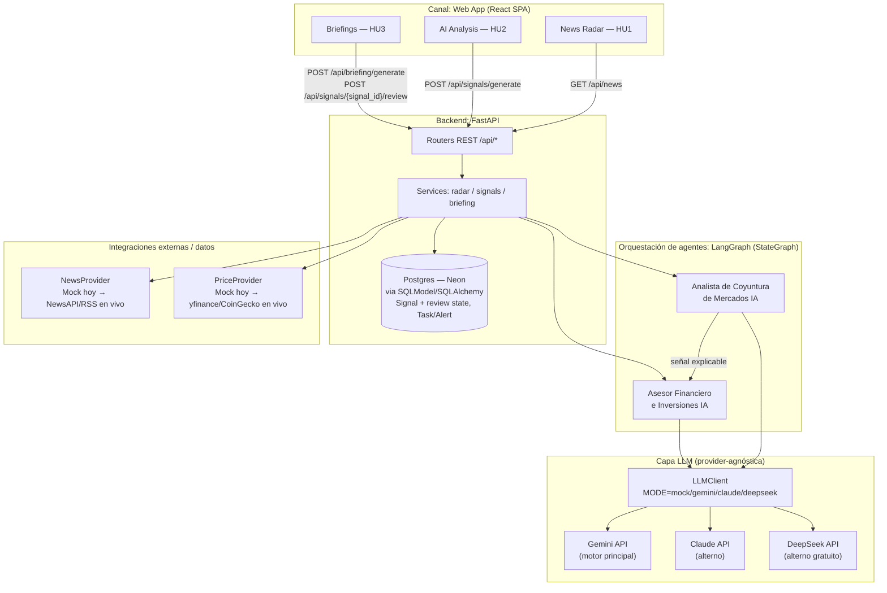

# Documento Técnico — MarketMind AI (Track 5)

> **Uso de Google Gemini:** este proyecto usa la **API de Gemini** (`gemini-flash-latest`) como motor principal de los dos agentes de IA — el Analista de Coyuntura de Mercados y el Asesor Financiero e Inversiones corren sobre Gemini en producción. La capa `LLMClient` (`backend/agents/llm.py`) es provider-agnóstica (Claude y DeepSeek quedan disponibles como alternos con el mismo contrato, cambiando una sola variable de entorno), pero el motor con el que se demuestra el producto es Gemini. Aplica al premio **"Best Use of Google Gemini"**.

## 1. Track asignado

**Track 5 — Inteligencia de Mercado y Recomendaciones Informadas por Noticias.**

Problema que resuelve: convierte noticias y datos verificables de mercado en señales explicables sobre renta variable, instrumentos de crédito, criptoactivos y otros activos, para ayudar a priorizar el análisis **sin ejecutar operaciones ni prometer rendimientos**.

Agentes involucrados:
- **Analista de Coyuntura de Mercados IA** — clasifica el impacto de una noticia (positivo/negativo/neutral/incierto), lo compara contra el movimiento de precio real/mock del instrumento y explica la señal con evidencia y fuentes.
- **Asesor Financiero e Inversiones IA** — consume las señales del Analista y arma un briefing ejecutivo por watchlist con acciones de investigación sugeridas, para revisión y aprobación humana.

## 2. Tipo de negocio al que aplica

Diseñado para **mesas de análisis e investigación financiera** que necesitan triage rápido de noticias antes de que un humano decida: bancas de inversión, gestoras de patrimonio (wealth management) y RIAs, brokers/casas de bolsa con equipos de research, fintechs de inversión que ofrecen contenido informativo a sus usuarios, y equipos de riesgo/compliance que necesitan trazabilidad de por qué se generó una alerta.

El producto **no es** una plataforma de trading ni un asesor automatizado que ejecuta operaciones — es una herramienta de **priorización y explicabilidad** que reduce el tiempo que un analista humano tarda en decidir qué investigar primero, dejando la decisión final (y su justificación) siempre en manos de una persona.

### Productos similares en el mercado y diferenciación

El propio track cita **Google Finance** y **CoinMarketCap** como referencia. Ambos son agregadores de datos (precio, volumen, noticias enlazadas) sin una capa de análisis explicable ni un flujo de revisión humana:

| | Google Finance / CoinMarketCap | MarketMind AI |
|---|---|---|
| Noticias | Enlaza titulares externos | Relaciona cada noticia con instrumentos, sector y tema, con filtros |
| Impacto | No lo evalúa | Clasifica impacto + confianza, comparado contra el movimiento de precio real |
| Explicabilidad | Ninguna | Evidencia citada, fuentes, disclaimer explícito |
| Flujo de decisión | Ninguno (solo consulta) | Briefing con acción de investigación + revisión humana (revisada/escalada/descartada) con justificación persistida |
| Ejecución | N/A | Nunca ejecuta ni sugiere compra/venta — por diseño |

La diferenciación no es "más datos", sino **convertir la información en una decisión de investigación trazable**, algo que ninguno de los productos de referencia ofrece.

Tercer eje de diferenciación: **contexto financiero y regulatorio local**, explícitamente pedido por el criterio de evaluación "Impacto/Ajuste al Track". Ni Google Finance ni CoinMarketCap cubren Ecuador de forma dedicada. El sistema incluye una watchlist **Ecuador & LatAm** con noticias del Banco Central del Ecuador, la Superintendencia de Bancos (SBS) y medios locales (Primicias), analizadas contra el precio real de un instrumento de referencia (bono soberano Ecuador 2035) — el mismo pipeline explicable de HU1-HU3, aplicado al mercado que más le importa a este jurado.

## 3. Diagrama de arquitectura

**Por qué LangGraph:** modela explícitamente el flujo `Analista → Asesor` como un grafo de estados con nodos puros y testeables por separado (ver `tests/test_analyst_node.py`, `test_advisor_node.py`, `test_agent.py`), en vez de encadenar llamadas sueltas al LLM. Esto es lo que el organizador del hackathon describe como "nivel intermedio" de arquitectura agéntica verificable.

**Por qué la capa `LLMClient` es provider-agnóstica:** permite construir y demostrar el flujo completo sin necesidad de una API key (`MODE=mock`, respuestas deterministas basadas en las mismas reglas de negocio), y activar Gemini real cambiando una sola variable de entorno (`LLM_MODE=gemini`). Claude y DeepSeek quedan disponibles como alternos con el mismo contrato — útil ante límites de cuota gratuita sin tener que tocar los nodos del grafo ni los prompts.

**Por qué Postgres (Neon) y no solo SQLite:** el entorno gratuito de despliegue (Render) no ofrece disco persistente, así que sin una base externa las señales y tareas se perderían en cada redeploy o cuando el servicio gratuito se reinicia por inactividad. `backend/db.py` usa SQLAlchemy de forma genérica — SQLite sigue siendo el default para desarrollo local (cero configuración), y `DATABASE_URL` apunta a una base Postgres gestionada (Neon, capa gratuita) en producción, sin cambiar una sola línea de los modelos o servicios.

## 4. Mitigación de riesgos / antialucinación

- El Analista **solo** recibe como contexto la noticia y la comparación de precio reales/mock provistas — el prompt (`backend/agents/prompts.py`) prohíbe explícitamente inventar cifras, fuentes o eventos fuera de ese contexto.
- Toda señal incluye **evidencia citada**, **fuentes** y un **disclaimer** explícito de que no constituye asesoría personalizada ni garantiza resultados (criterio de aceptación de HU2).
- El campo `suggested_action` (Analista) y `research_action` (Asesor) están restringidos por diseño y por tests (`tests/test_analyst_node.py::test_signal_never_suggests_trade_execution`, `tests/test_advisor_node.py::test_advisor_never_suggests_trade_execution`) a ser siempre una acción de **investigación o revisión humana**, nunca una orden de compra/venta.
- Toda señal queda persistida con `review_status=pending` hasta que un humano la marque como `revisada`, `escalada` o `descartada`, guardando su justificación (HU3) — el sistema nunca actúa de forma autónoma sobre una señal.
- El Dashboard incluye un indicador de **"track record"**: compara, sobre todas las señales generadas, si la dirección que clasificó el Analista (positivo/negativo/neutral) coincide con el movimiento de precio real que se le mostró. No es una predicción de resultados futuros — es un mecanismo de auditoría continua que expone si el agente está clasificando de forma consistente con la evidencia que tuvo, en vez de simplemente confiar en la confianza que el propio modelo reporta.

## 5. Cómo se integraría a un sistema empresarial existente

El sistema está diseñado con puntos de extensión explícitos para no requerir reescritura al integrarse a infraestructura real:

- **Datos de mercado y noticias:** `NewsProvider` y `PriceProvider` (`backend/providers/`) son interfaces (`Protocol`) con una implementación Mock hoy. Reemplazarlas por fuentes reales (Bloomberg/Refinitiv/NewsAPI para noticias; un feed de mercado con licencia, yfinance o CoinGecko para precios) es una nueva clase que implementa el mismo contrato — routers y servicios no cambian.
- **Autenticación y control de acceso:** el backend FastAPI se integra de forma estándar detrás de un API Gateway con SSO/OAuth corporativo (Azure AD, Okta) para restringir por rol (analista junior vs. lead vs. compliance) quién puede generar señales, revisar o escalar.
- **Trazabilidad y auditoría (compliance):** cada `Signal` y `TaskAlert` queda persistida con timestamp, fuente, evidencia y justificación humana en una base Postgres gestionada (no en un archivo efímero) — ese mismo modelo (`backend/models.py`) puede escribirse a un data warehouse corporativo (o exportarse vía un endpoint adicional) para cumplir requisitos regulatorios locales de trazabilidad de recomendaciones.
- **Notificaciones y flujo de trabajo:** los `TaskAlert` que hoy se listan en la UI pueden publicarse como eventos (webhook) hacia herramientas ya usadas por el equipo — Slack/Teams para alertas en tiempo real, Jira/ServiceNow para asignar el research como ticket formal.
- **Despliegue:** el backend es un contenedor Docker autocontenido (`Dockerfile`) desplegable en cualquier plataforma corporativa (Kubernetes, ECS, Azure Container Apps) sin cambios; el frontend es un build estático (Vite) servible desde cualquier CDN interno.
- **Cambio de proveedor LLM:** si la empresa ya tiene un contrato con un proveedor de LLM distinto (Azure OpenAI, Vertex AI, Claude vía Bedrock), solo se agrega un nuevo modo en `LLMClient` (`backend/agents/llm.py`) — el resto del sistema (grafo, prompts, schemas de salida) no se toca.

## 6. Criterios de aceptación (Given/When/Then)

Siguiendo un enfoque de **Spec-Driven Development** (la especificación es la fuente de verdad; el código es una implementación que debe satisfacerla), cada criterio de aceptación de las 3 Historias de Usuario del track se tradujo en un escenario verificable y en un test automatizado concreto — no queda como una opinión de si "funciona", sino como evidencia ejecutable.

### HU1 — Radar de noticias y activos

- **DADO** que existen noticias de al menos 2 fuentes distintas, **CUANDO** se consulta el Radar, **ENTONCES** cada noticia muestra su fuente, fecha e instrumentos relacionados.
  → `tests/test_api.py::test_news_filters_by_asset`
- **DADO** que se filtra por tipo de instrumento, activo o antigüedad, **CUANDO** se aplica el filtro, **ENTONCES** solo se devuelven noticias que cumplen ese criterio.
  → `tests/test_api.py::test_news_filters_by_max_age`, `test_news_filters_by_asset`
- **DADO** un término de búsqueda libre, **CUANDO** se ejecuta la búsqueda, **ENTONCES** solo aparecen noticias cuyo título, resumen, fuente o instrumentos contienen ese término.
  → `tests/test_api.py::test_news_free_text_search`

### HU2 — Señal explicable de impacto

- **DADO** una noticia y su instrumento relacionado, **CUANDO** se genera el análisis, **ENTONCES** el sistema devuelve un impacto (positivo/negativo/neutral/incierto) y un nivel de confianza entre 0 y 1, consistente con el movimiento de precio real.
  → `tests/test_analyst_node.py::test_positive_price_move_yields_positive_impact` (y negative/neutral)
- **DADO** que ya existe una señal reciente para esa (noticia, instrumento), **CUANDO** se vuelve a pedir el análisis sin forzar regeneración, **ENTONCES** se reutiliza la señal existente en vez de llamar al LLM de nuevo.
  → `tests/test_api.py::test_signal_generate_reuses_existing_by_default`
- **DADO** cualquier señal generada, **CUANDO** se inspecciona su contenido, **ENTONCES** incluye evidencia citada, fuentes, comparación de precio y un disclaimer explícito de que no es asesoría personalizada.
  → `tests/test_analyst_node.py::test_signal_includes_disclaimer_and_sources`
- **DADO** cualquier señal generada, **CUANDO** se inspecciona la acción sugerida, **ENTONCES** nunca contiene una instrucción de comprar o vender.
  → `tests/test_analyst_node.py::test_signal_never_suggests_trade_execution`

### HU3 — Briefing con revisión humana

- **DADO** una watchlist con instrumentos y noticias asociadas, **CUANDO** se genera el briefing, **ENTONCES** cada ítem incluye noticia, movimiento de precio y una acción de investigación sugerida.
  → `tests/test_api.py::test_briefing_generate_creates_tasks_not_orders`
- **DADO** un briefing generado, **CUANDO** un analista marca una señal como revisada/escalada/descartada con una justificación, **ENTONCES** el estado y la justificación quedan persistidos.
  → `tests/test_api.py::test_signal_generate_and_review_flow`
- **DADO** que se genera un briefing, **CUANDO** se crean tareas asociadas, **ENTONCES** ninguna representa una orden de compra/venta — solo una acción de investigación para revisión humana.
  → `tests/test_advisor_node.py::test_advisor_never_suggests_trade_execution`
- **DADO** que ya existe una señal/tarea para una (noticia, instrumento), **CUANDO** se regenera el briefing sin forzar, **ENTONCES** no se crean tareas duplicadas.
  → `tests/test_api.py::test_briefing_generate_reuses_signals_and_does_not_duplicate_tasks`
- **DADO** una tarea abierta, **CUANDO** se marca como hecha, **ENTONCES** su estado cambia a `done` y puede reabrirse.
  → `tests/test_api.py::test_task_complete_and_reopen_flow`

## 7. Evidencia de pruebas

Ver `tests/` (pytest): tests de nodos del grafo con LLM mockeado (`test_analyst_node.py`, `test_advisor_node.py`), smoke test del pipeline completo (`test_agent.py`), tests de reintentos ante fallos transitorios del LLM (`test_llm_retry.py`) y tests de los endpoints (`test_api.py`) — incluyendo verificación explícita de que ninguna salida del sistema sugiere una orden de compra/venta, deduplicación de señales/tareas, y casos borde (recursos desconocidos, estados de revisión inválidos, filtros de tareas). **34 tests en total**, corridos automáticamente en cada push vía GitHub Actions (`.github/workflows/ci.yml`, badge visible en el `README.md`). Correr localmente con `pytest` desde la raíz del repo.
